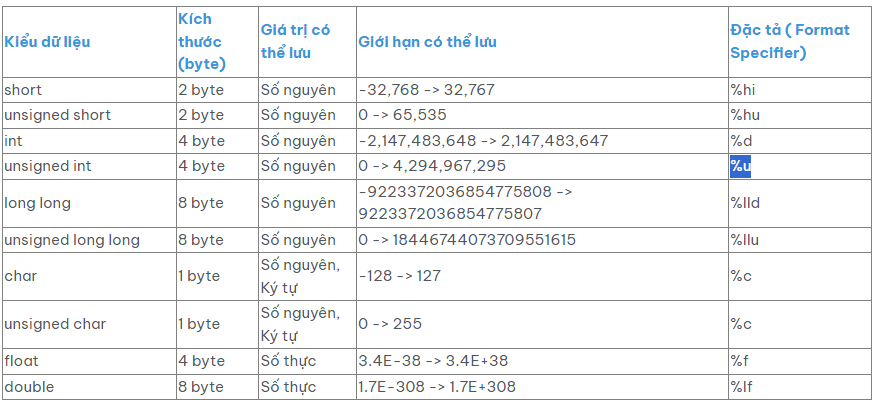

# Variable in C

## I. Các khái niệm 

	- Biến nơi lưu trữ tạm thời dữ liệu với một kiểu dữ liệu xác định. Biến có thể thay đổi giá trị trong quá trình thực thi chương trình, do đó được gọi là biến.
	
	- Biến được lưu vào bộ nhớ Ram.
	
## II. Các kiểu dữ liệu cơ bản 
	
	Các kiểu dữ liệu cơ bản:
	


## III. Các lớp lưu trữ
	
	Timelife: Thời gian sống của biến (khi nào biến được cấp phát trong bộ nhớ và khi nào biến bị bỏ đi)
	
	Scope: Phạm vi của biến có tác dụng
	
	Biến trong bộ nhớ: 
	


	Heap:
	
	- Heap là một vùng nhớ động được cấp phát và giải phóng bởi người dùng.
	
	- Cấp phát và giải phóng vùng nhớ trên heap được xác định tại thời điểm chạy (runtime).
	
	- Dữ liệu trên heap sẽ tồn tại cho đến khi chương trình viên giải phóng và hoàn toàn khi chương trình kết thúc.
	
	- Để cấp phát và giải phóng vùng nhớ trên heap, phải sử dụng các hàm như "malloc", "calloc", "realloc" và "free".
	
	- Có thể truy cập các biến trên heap thông qua con trỏ.
	
	Stack:

	- Stack là một vùng nhớ tĩnh và được quản lý tự động.
	
	- Thời gian sống của biến trên stack được xác định bởi phạm vi của biến (scope).
	
	- Khi phạm vi của biến kết thúc, nó sẽ tự động bị giải phóng.
	
	- Dữ liệu trên stack lưu trữ thông qua biến cục bộ và tham số trong hàm.
	
	- Được sử dụng để lưu trữ các giá trị tạm thời và các biến cục bộ trong hàm.
	
	- Truy cập và cập nhật dữ liệu trên stack nhanh hơn so với heap.
	
	Global & Static Object:
	
	- Static: Biến static chỉ khởi tạo giá trị 1 lần, chỉ kết thúc khi chương trình kết thúc 
	
	- Global: Biến toàn cục, chỉ kết thúc khi chương trình kết thúc

## IV. Key words sử dụng cho biến

	Static:
	
	-  Biến static hay biến tĩnh, được tạo ra bên trong một khối lệnh có khả năng lưu giữ giá trị của nó cho dù chương trình đã chạy ra bên ngoài khối lệnh chứa nó.

	- Khi 1 biến cục bộ được khai báo với từ khóa static. Biến sẽ chỉ được khởi tạo 1 lần duy nhất và tồn tại suốt thời gian chạy chương trình. Giá trị của nó không bị mất đi ngay cả khi kết thúc hàm.
	
	- Tuy nhiên khác với biến toàn cục có thể gọi trong tất cả mọi nơi trong chương trình, thì biến cục bộ static chỉ có thể được gọi trong nội bộ hàm khởi tạo ra nó. Mỗi lần hàm được gọi, giá trị của biến chính bằng giá trị tại lần gần nhất hàm được gọi.
		
	Extern:
	
	- Trong C, khi 1 biến đi sau từ khóa “extern” có nghĩa là:

		- Nó là tham chiếu của một biến,hàm cùng tên nào đó, đã được định nghĩa bên ngoài. Nó chỉ khai báo chứ không định nghĩa ( cấp phát bộ nhớ cho biến ).
		
		- Biến được tham chiếu phải được khai báo ở cấp độ cao nhất (toàn cục), và có thể nằm trong một file khác.
	
	Register: làm tăng hiệu năng(performance) của chương trình. Khi thêm từ khóa register để khai báo biến, thì tức là ta đã yêu cầu trình biên dịch ưu tiên đặc biệt dành luôn vùng register để chứa biến đó.
	
	Volatile: 
	
		- Volatile có nghĩa là không dự đoán được. Một biến sử dụng với volatile qualifier có nghĩa là nói với compiler là biến này có thể sẽ được thay đổi ở bất kì chỗ nào

		- Khi mà giá trị của nó có thể thay đổi một cách không báo trước. Việc khai báo biến volatile là rất cần thiết để tránh những lỗi sai khó phát hiện do tính năng optimization của compiler.
## V. Struct data type

	Struct: 1 struct có thể chứa các biến khác nhau không cùng kiểu dữ liệu.
	
	Cú pháp khai báo 1 struct: 
	
	```C
	struct structureName 
	{
		dataType member1;
		dataType member2;
		...
	};
	```
	
## VI. Casting
 
	