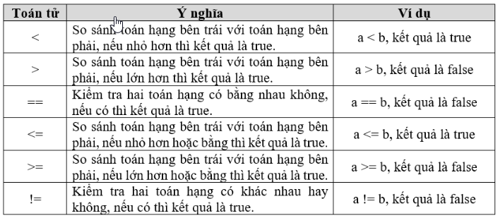
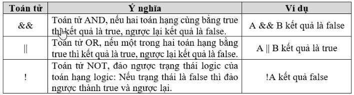

# MẢNG VÀ CẤU TRÚC RẼ NHÁNH

## Array

### 1. Mảng là gì?
	
Mảng 1 chiều:

	- Mảng là tập hợp các phần tử có cùng kiểu dữ liệu trên 1 vùng ô nhớ liền kề nhau.
	
	- Các số thứ tự phần tử của mảng là các số nguyên dương được ghi trong [ ] sau tên mảng 
	
	- Phần tử mảng bắt đầu từ 0. VD: Mảng a có 10 phần tử bao gồm các phần tử a[0] ... a[9].

Mảng 2 chiều: <kiểu dữ liệu> arr[hàng][cột];
	
	- Mảng 2 chiều có thể là mảng của 2 mảng 1 chiều
	
	- Mảng 2 chiều chứa các hàng, các cột.
	
Số phần tử của mảng phải được xác định từ khi khởi tạo.

Các phân tử mảng được cấp phát liên tiếp nhau vào bộ nhớ.
	
	
## Cấu trúc rẽ nhánh

### 1. Câu lệnh if - else:

**Cấu trúc:** 
	
- Dạng thiếu: 
```c 
if(điều kiện)
	{ Câu lệnh };
```

- Dạng đủ:
		
```c
if ({Biểu_thức_logic})
    {Câu_lệnh_1};
else 
    {Câu_lệnh_2};
```
	
Trong trường hợp có nhiều câu lệnh tạo thành một khối lệnh:
```c
if ({Biểu_thức_logic})
{
    {Khối_lệnh_1};
}
else 
 {
     {Khối_lệnh_2};
 }
```

### 2. Cấu trúc lựa chọn switch ... case:

	Cú pháp:	
```c
switch ({Biểu_thức})
{
    case {Giá_trị_1}:
        {Câu_lệnh_1};
        break;
        
    case {Giá_trị_2}:
        {Câu_lệnh_2};
        break;
        
    case {Giá_trị_3}:
        {Câu_lệnh_3};
        break;
    ...
        
    default:
        {Câu_lệnh_mặc_định};
}    
```

Trong trường hợp nhiều giá trị có chung công việc thực hiện, ta có thể viết theo cách sau:
```c
case {Giá_trị_1} : case {Giá_trị_2} : ... : case {Giá_trị_n}:
    {Câu_lệnh};
    break;
```

## Toán tử quan hệ và toán tử logic

### 1. Toán tử quan hệ:



### 2. Toán tử logic:



## Vòng lặp

### 1. Câu lệnh while():

Cú pháp:

```c 
while (condition) {
    statements;
}
```

While thuộc về vòng lặp kiểm soát đầu vào. Trong vòng lặp này, một điều kiện được đánh giá trước khi xử lý thân vòng lặp. Một điều kiện đúng khi và chỉ khi thân vòng lặp được thực thi. Tiếp đó, điều khiển sẽ quay trở lại lúc đầu và kiểm tra đối chiếu với điều kiện xem nó có đúng không. Quá trình này sẽ được lặp đi lặp lại cho đến khi cho kết quả false. Khi đó, câu lệnh điều khiển sẽ thoát khỏi vòng lặp.

Trong vòng lặp while, nếu điều kiện sai, thân vòng lặp sẽ không thực hiện.

### 2. Câu lệnh for():

Cú pháp:

```c
for (initialization; condition; increment/decrement) {
  // code to execute repeatedly
}
```

– Initialization: là lệnh khởi tạo giá trị ban đầu cho biến sử dụng trong vòng lặp.

– Condition: là điều kiện để vòng lặp tiếp tục hoặc kết thúc.

– Increment/decrement: là lệnh tăng hoặc giảm giá trị của biến sử dụng trong vòng lặp.

### 3. Câu lệnh do ... while:
Cú pháp:

```c
do {statements} 
 while (expression);
```
Thân vòng lặp while được thực khi và chỉ khi điều kiện đúng. 

Ở trường hợp ngược lại, nếu chúng ta muốn thực thi vòng lặp ít nhất một lần, ngay cả khi điều kiện sai, có thể sử dụng vòng lặp do-while.

Trong vòng lặp do-while, thân vòng lặp luôn được thực thi ít nhất một lần. Sau đó, nó sẽ tiến đến giai đoạn kiểm tra điều kiện. Nếu điều kiện đúng, thân vòng lặp sẽ được thực thi thêm một lần nữa. Nếu sai, điều khiển sẽ thoát ra khỏi vòng lặp.

### 4. Các lệnh điều khiển vòng lặp:


