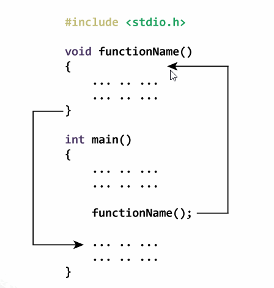

# Function

```c 
#include <stdio.h>

int addition(int a, int b); // Nguyên mẫu hàm (Function prototype)

int main() {

    int x, y, result;
    printf("Enter x: ");
    scanf("%d", &x);
    printf("Enter y: ");
    scanf("%d", &y);

    result = addition(x, y); // Gọi hàm (Function call)

    printf("x + y = ", result);

    return 0;
}
int addition(int a, int b){ // Định nghĩa hàm (Function definition)
    int sum;
    sum = a + b;
    return sum; // Trả về kết quả của hàm (Return statement)
}
```

## I. Cách hoạt động của hàm trong C 

Hình ảnh dưới đây cho bạn thấy cách hoạt động của hàm (chương trình con) ở trong ngôn ngữ C. Khi một lời gọi hàm được thực thi thì:

- Chương trình của bạn sẽ nhảy tới nơi định nghĩa hàm đó và thực thi các lệnh từ trên xuống dưới ở trong hàm đó.

- Khi hàm thực hiện xong, chương trình tiếp tục quay về thực hiện các lệnh phía sau lời gọi hàm.


## II. Định nghĩa hàm

Ngoài việc sử dụng các hàm viết sẵn được định nghĩa trong các thư viện của chương trình C chúng ta cũng có thể tạo các hàm theo mục đích hoặc yêu cầu của bài toán.

Những hàm được lập trình viên tạo ra được gọi là hàm do người dùng định nghĩa.

Mỗi hàm thực hiện một chức năng cụ thể.

**Function prototype**

- Nguyên mẫu hàm chỉ là khai báo một hàm gồm tên hàm, các tham số và kiểu trả về. Không chứa thân hàm.

- Nó cung cấp cho trình biên dịch là hàm này có thể được sử dụng trong chương trình.

- Cú pháp: ``` returnType functionName(dataType1 argument1, dataType2 argument2, ...); ```

**Function Call**

- Cú pháp ``` functionName(argument1, argument2, ...);```

**Function definition**

- Định nghĩa hàm cho hàm một khối lệnh để hàm thực hiện chức năng cụ thể.

- Cú pháp: 

```c 
returnType functionName(dataType1 argument1, dataType2 argument2, ...){
    // body of the function
}
```

*Khi hàm được gọi (function call) trình biên dịch chuyển đến hàm và bắt đầu thực thi các câu lệnh bên trong thân hàm.*

**Đối số và tham số:**

- Đối số: (argument) là cách chúng ta gọi các biến được truyền cho hàm. 

VD: hai biến x và y là đối số.

- Tham số: (parameter) a và b chấp nhận đối số được truyền vào hàm, được coi là tham số chính thức của hàm.

- Kiểu dữ liệu của đối số và tham số phải trùng với nhau nếu không chương trình sẽ bị lỗi.

- Một hàm đôi khi cũng không cần truyền đối số.

**Return statement:**
- Câu lệnh return kết thúc thực thi của một hàm và trả về giá trị cho hàm đang được gọi.

- Trong ví dụ trên giá trị của biến kết quả trong hàm addition() được trả về hàm main() và biến result được gán giá trị này.

- Cú pháp: ``` return (expression);```

*Kiểu dữ liệu được trả về từ hàm và kiểu dữ liệu trả về được chỉ định trong nguyên mẫu hàm (hoặc định nghĩa hàm) phải khớp nhau.*

## III. Các loại hàm trong C

### 1. Hàm không có tham số, không có giá trị trả về:

VD: ``` void checkPrimeNumber(); ```

### 2. Hàm không có tham số, có trả về giá trị:

VD: ```int getInteger();```

### 3. Hàm có tham số, không trả về giá trị:

VD: ```void checkPrimeAndDisplay(int n):```

### 4. Hàm có tham số, có trả về giá trị:

VD: ```int checkPrimeNumber(int n);```