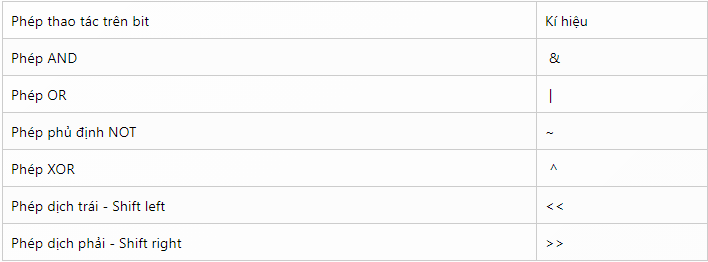
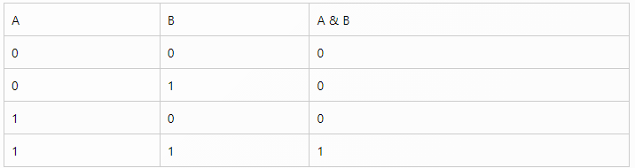
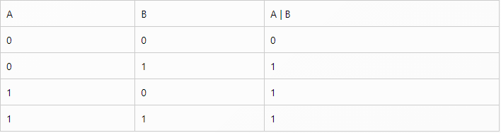
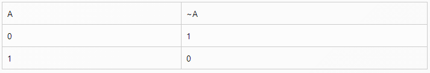
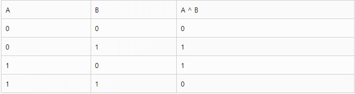

# Macro and Bit Operation

## Macro:

### 1. Macro:

Macro được dùng để chỉ những hàm được viết ở phần Preprocessor, thay vì đặt nó vào trong phần thực thi của file nguồn.

VD:

`#define ADD_TWO_NUMBER(x, y) ((x) + (y))`

Và dùng nó ở đoạn code dưới đây:

```
int z_1 = ADD_TWO_NUMBER(10, 3);
float z_2 =  ADD_TWO_NUMBER(10.1, 3.7);
```

Macro trên sẽ khớp với bất cứ đoạn code nào có dạng `ADD_TWO_NUMBER(param_1, param_2)`và thay nó bằng param_1 + param_2 và nó không (thể) biết `param_1` và `param_2` là gì, có thể là biểu thức có thể là biến, có thể là string mà cũng có thể là `int`. Đó cũng chính là điểm mạnh và cũng là điểm yếu của macro, bạn có thể dùng hàm trên để cộng 2 biến kiểu `int` hay `float` như trên. Tuy nhiên nó cũng tiềm tàng nhiều mối nguy hiểm mà mình sẽ đề cập ở 1 bài khác.

### 2. Các thao tác với Macro:

**Toán tử ##**

Toán tử ## có tác dụng nối 2 token lại với nhau.

Ví dụ như bạn muốn khai báo 3 biến là `normal_bike_price`, `premium_bike_price`, `low_bike_price`, thì thay vì khai báo thủ công, bạn có thể dùng macro như sau.

```
#define DECLARE_VARIABLES(type, name) type normal_##name, premium_##name, low_##name
...
DECLARE_VARIABLES(int, bike_price);
```

Câu lệnh trên sẽ được chuyển thành đoạn code sau khi chạy chương trình:

`int normal_bike_price, premium_bike_price, low_bike_price;`

**Macro nhiều dòng (multi line macro)**

Để khai báo một function (tầm cỡ vài chục câu lệnh) thì ý tưởng viết tất cả chúng vào tất cả 1 dòng là không sáng sủa tí nào. Và để xuống dòng trong macro thì bạn sẽ dùng ký tự \. Như trong ví dụ sau đây chúng ta sẽ sửa lại đoạn code trên 1 chút để nó thành 1 macro có nhiều dòng nhằm cho thấy tác dụng của kí tự \.

```
#define DECLARE_VARIABLES(type, name) type normal_##name;\
type premium_##name;\
type low##_name;
```

**Toán tử #**

Toán tử # dùng để chuyển 1 token nào đó thành chuỗi. Ví dụ như sau:

```
#define print_variable_name_and_value(x) printf(#x " value is: %d", x)
...
int x = 10;
print_variable_name_and_value(x);
```

câu lệnh `print_variable_name_and_value(x);` sẽ được chuyển thành `printf("x" " value is: %d", x);` và kết quả câu lệnh trên sẽ là

`x value is: 10 `

## Bit Operation



### 1. Phép AND:

Kí hiệu: &

Bảng chân lý:



Phép AND chỉ có giá trị 1 nếu cả hai toán hạng đều có giá trị 1.

Ví dụ:
```
A            0000 1100
B            0101 0101
C = A & B    0000 0100
```

### 2. Phép OR:

Kí hiệu: `|`

Bảng chân lý:



Phép OR chỉ có giá trị 0 nếu cả hai toán hạng đều có giá trị 0.

Ví dụ:
```
A            0000 1100
B            0101 0101
C = A | B    0101 1101
```

### 3. Phép NOT:

Kí hiệu: ~

Bảng chân lý:



Phép NOT đảo bit 1 thành 0 và ngược lại.

Ví dụ:
```
A         0000 1100
B = ~A    1111 0011
```

### 4. Phép XOR:

Kí hiệu: ^

Bảng chân lý: 



Phép XOR chỉ có giá trị 0 nếu cả hai toán hạng có cùng giá trị, cùng là giá trị 1, hay cùng là giá trị 0.

VD:
```
A            0000 1100
B            0101 0101
C = A ^ B    0101 1001
```

### 5. Phép dịch trái:

Kí hiệu: <<

Ví dụ:
```
A             0000 1100
                   <—
B = A << 2    0011 0000
```

### 6. Phép dịch phải:

Kí hiệu: >>

Ví dụ:
```
A             0000 1100
                   —>
B = A >> 2    0000 0011
```
