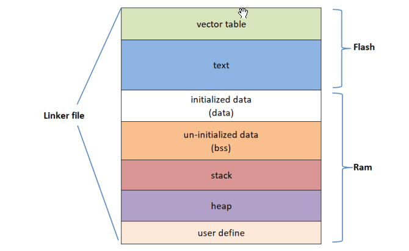

# MEMORY AND POINTER

## MEMORY

### 1. Memory layout



Sự khác nhau giữa bộ nhớ Ram và Flash:

| Ram | Flash|
|-----|------|
| Bộ nhớ tạm thời | Bộ nhớ lưu trữ lâu dài |
| Tốc độ cao | Tốc độ chậm hơn Ram |
| Dễ dàng đọc/ghi | Đọc dễ, ghi vào cần phải thông qua flash controller |
| Có thể ghi đè | Flash phải xóa mới được ghi vào |

**Vector table:** Chứa địa chỉ hàm ngắt để khi ngắt xảy ra sẽ thực hiện ngắt.

**Text:** Chứa code, chứa các biến constant.

**Initialized data (data):** Chứa các biến globle đã được tạo giá trị khác 0 và biến static.

**Un-Initialized data (bss):** Chứa các biến globle và biến static chưa được khởi tạo giá trị hoặc khởi tạo giá trị = 0.

--> Tiết kiệm thời gian vì các biến bằng 0 chỉ cần cấp phát địa chỉ còn các biến trong data phải khởi tạo giá trị và copy giá trị.

**Stack:** Các biến local (chỉ tồn tại trong hàm của nó).

**Heap:** Sử dụng cho cấp phát động (malloc, calloc,...).

**Linker file:** cấp phát địa chỉ vùng nhớ cho các vùng tương ứng.

## POINTER

## CẤP PHÁT BỘ NHỚ ĐỘNG TRONG C 

Để cấp phát vùng nhớ động cho biến con trỏ trong ngôn ngữ C, bạn có thể sử dụng hàm malloc() hoặc hàm calloc(). Sử dụng hàm free() để giải phóng bộ nhớ đã cấp phát khi không cần sử dụng, sử dụng realloc() để thay đổi (phân bổ lại) kích thước bộ nhớ đã cấp phát trong khi chạy chương trình.

### 1. Hàm malloc():

Từ malloc là đại diện cho cụm từ memory allocation (dịch: cấp phát bộ nhớ).

Hàm malloc() thực hiện cấp phát bộ nhớ bằng cách chỉ định số byte cần cấp phát. Hàm này trả về con trỏ kiểu void cho phép chúng ta có thể ép kiểu về bất cứ kiểu dữ liệu nào.

Cú pháp:

```c 
ptr = (castType*) malloc(size);
```

VD:

```c 
ptr = (int*) malloc(100 * sizeof(int));
```

Trong trường hợp không thể cấp phát bộ nhớ, nó sẽ trả về một con trỏ NULL.

VD: Trong ví dụ dưới đây, chúng ta sẽ sử dụng hàm malloc() để cấp phát động ``` n * sizeof int byte ``` và sử dụng xong sẽ dùng free() để giải phóng.
```c 
#include <stdio.h>
// Thư viện này cần để cấp phát bộ nhớ động
#include <stdlib.h>

int main()
{
    int n, i, *ptr, sum = 0;
    printf("Nhap so luong phan tu: ");
    scanf("%d", &n);
    ptr = (int *)malloc(n * sizeof(int));

    // Nếu không thể cấp phát, 
    // hàm malloc sẽ trả về con trỏ NULL
    if (ptr == NULL)
    {
        printf("Co loi! khong the cap phat bo nho.");
        exit(0);
    }
    printf("Nhap cac gia tri: ");
    for (i = 0; i < n; ++i)
    {
        scanf("%d", ptr + i);
        sum += *(ptr + i);
    }
    printf("Tong = %d", sum);

    // Giải phóng vùng nhớ cho con trỏ
    free(ptr);
    return 0;
}
```
 
 ### 2. Hàm calloc():
 
Từ calloc đại diện cho cụm từ contiguous allocation (dịch: cấp phát liên tục).

Hàm malloc() khi cấp phát bộ nhớ thì vùng nhớ cấp phát đó không được khởi tạo giá trị ban đầu. Trong khi đó, hàm calloc() thực hiện cấp phát bộ nhớ và khởi tạo tất cả các ô nhớ có giá trị bằng 0.

Hàm calloc() nhận vào 2 tham số là số ô nhớ muốn khởi tạo và kích thước của 1 ô nhớ.

Cú pháp: 

```c 
ptr = (castType*)calloc(n, size);
```

VD:

```c 
ptr = (int*) calloc(100, sizeof(int));
```

VD: Trong ví dụ này, chúng ta sẽ dùng calloc() để cấp phát n ô nhớ liên tiếp và mỗi ô nhớ có kích thước là sizeof int. Lưu ý là hàm calloc() sẽ chậm hơn malloc() một chút do nó phải thêm bước khởi tạo các ô nhớ có giá trị bằng 0. Do đó, tùy thuộc bạn cần hiệu năng hay cần khởi tạo giá trị ban đầu mà sử dụng hàm cấp phát thích hợp.

```c 
#include <stdio.h>
// Thư viện này cần để cấp phát bộ nhớ động
#include <stdlib.h>

int main()
{
    int n, i, *ptr, sum = 0;
    printf("Nhap so luong phan tu: ");
    scanf("%d", &n);
    ptr = (int *)calloc(n, sizeof(int));

    // Nếu không thể cấp phát, 
    // hàm calloc sẽ trả về con trỏ NULL
    if (ptr == NULL)
    {
        printf("Co loi! khong the cap phat bo nho.");
        exit(0);
    }
    printf("Nhap cac gia tri: ");
    for (i = 0; i < n; ++i)
    {
        scanf("%d", ptr + i);
        sum += *(ptr + i);
    }
    printf("Tong = %d", sum);

    // Giải phóng vùng nhớ cho con trỏ
    free(ptr);
    return 0;
}
```

### 3. Hàm free():

Việc cấp phát bộ nhớ động trong C dù sử dụng malloc() hay calloc() thì chúng cũng đều không thể tự giải phóng bộ nhớ. Bạn cần sử dụng hàm free() để giải phóng vùng nhớ.

Cú pháp:

```c
free(ptr); // ptr là con trỏ
```

Lệnh này sẽ giải phóng vùng nhớ mà con trỏ ptr đã được cấp phát. Giải phóng ở đây có nghĩa là trả lại vùng nhớ đó cho hệ điều hành và hệ điều hành có thể sử dụng vùng nhớ đó vào việc khác nếu cần.

Nếu bạn không giải phóng nó thì nó sẽ tồn tại cho tới khi chương trình kết thúc. Điều này sẽ rất nguy hiểm nếu chương trình của bạn liên tục cấp phát các vùng nhớ mới và sẽ gây ra hiện tượng tràn bộ nhớ.

### 4. Hàm realloc():

Nếu việc cấp phát bộ nhớ động không đủ hoặc cần nhiều hơn mức đã cấp phát, bạn có thể thay đổi kích thước của bộ nhớ đã được cấp phát trước đó bằng cách sử dụng hàm realloc().

Cú pháp:

```c 
ptr = realloc(ptr, n);
```
Hàm này thực hiện cấp phát vùng nhớ mới cho con trỏ ptr. Vùng nhớ mới đó sẽ có kích thước mới là n bytes.

Hàm này cũng trả về con trỏ chứa giá trị là địa chỉ của byte đầu tiên trong vùng nhớ mới. Hàm này sẽ cố gắng mở rộng số ô nhớ ra phía sau nếu có thể để giữ nguyên giá trị của con trỏ ban đầu. Trong trường hợp phải đổi sang một vùng nhớ khác, hàm realloc() cũng sẽ mang theo giá trị đã có ở vùng nhớ cũ sang vùng nhớ mới và giải phóng luôn vùng nhớ cũ 

Trong trường hợp không thể, nó sẽ trả về con trỏ NULL giống như malloc() và calloc().

VD: Trong ví dụ dưới đây, ta sẽ sử dụng hàm realloc() để tái phân bổ lại bộ nhớ. Như trong ví dụ dưới đây thì việc cấp phát không phải di chuyển sang vùng nhớ khác mà chỉ mở rộng ra phía sau.

```c 
#include <stdio.h>
#include <stdlib.h>
int main()
{
    int *ptr, i , n1, n2;
    printf("Nhap so luong phan tu: ");
    scanf("%d", &n1);
    ptr = (int*) malloc(n1 * sizeof(int));
    printf("Dia chi cua vung nho vua cap phat: %u", ptr);
    
    printf("nNhap lai so luong phan tu: ");
    scanf("%d", &n2);
    // phân bổ lại vùng nhớ
    ptr = (int*) realloc(ptr, n2 * sizeof(int));
    printf("Dia chi cua vung nho duoc cap phat lai: %u", ptr);
    // giải phóng
    free(ptr);
    return 0;
}
```

Kết quả: 

```c
Nhap so luong phan tu: 2
Dia chi cua vung nho vua cap phat: 1993360
Nhap lai so luong phan tu: 100
Dia chi cua vung nho duoc cap phat lai: 1993360
```

