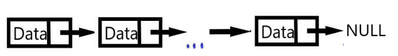

# DATA STRUCTURE AND ALGORITHMS

## I. Linked List

### 1. Danh sách liên kết đơn là gì?

Danh sách liên kết đơn có chức năng giống với mảng (array) như thêm, xóa phần tử,...Tuy nhiên danh sách liên kết là một cấu trúc dữ liệu đệ quy. 
Một danh sách liên kết sẽ bao gồm các "node". Mỗi "node" gồm 2 thành phần là dữ liệu (data) và con trỏ để trỏ tới "node" tiếp theo nhằm tạo mối liên kết. 
Nếu số lượng mối liên kết của mỗi "node" là một thì danh sách trên được gọi là danh dách liên kết đơn.


### 2. Xây dựng và một số thao tác với danh sách liện kết đơn:

Một "node" của danh sách liên kết đơn được xây dựng như sau (ở đây để đơn giản mình sẽ để data có kiểu dữ liệu int).

```c 
 typedef struct node* point; // typedef lại để code được rõ ràng và gọn gàng hơn
 struct node{
 	int data;
	point next; 
 }; 
 ```
Để thuận tiện cho việc xây dựng các hàm thêm và xóa  mình sẽ xây dựng hàm getNode, hàm này nhằm mục đích tạo ra 1 "node" có phần dữ liệu là x, giá trị hàm trả về là địa chỉ "node" đó.

```c 
point getNode(int x)
{
 	point p;
	p = (point)malloc(sizeof(node));
	if(p != NULL)
	{
		p->data = x;
		p->next = NULL;
	} 
	return p; 
}
```
Để quản lí danh sách liên kết đơn, người ta thường dùng 1 con trỏ trỏ vào "node" đầu tiên của danh sách (ở đây mình đặt tên là head), bên cạnh đó để tiện cho việc quản lí có thể dùng thêm 1 con trỏ trỏ vào "node" cuối cùng của danh sách (tail). 
Yêu cầu phải được đảm bảo là trong suốt quá trình thực hiện chương trình head luôn trỏ đến "node" đầu tiên, tail luôn trỏ tới "node" cuối cùng của danh sách. 
Nếu không đảm bảo được điều này, danh sách liên kết có thể dẫn đến những sự cố không mong muốn. Khi khai báo 

```
point head = NULL, tail = NULL;
```
dòng trên cho ta biết rằng danh sách này là danh sách rỗng.

**Thêm một phần tử vào đầu danh sách**
```
void addFirst(point &head, point &tail, int x)
{
 	point r = getNode(x);
	if(head == NULL)
	  	head = tail = r;
	else
	{
		r->next = head;
		head = r; 
	} 	 
} 
```
**Thêm một phần tử vào cuối danh sách**
```
void addLast(point &head,point &tail, int x)
{
 	point r = getNode(x);
	if(head == NULL)
	  	head = tail = r;
	else
	{
		tail->next = r;
		tail = r; 
	} 	 
} 
```
**Thêm 1 phần tử có giá trị x vào sau "node" p**
```
void addAfter(point p, int x)
{
	point q = getNode(x);
	q->next = p->next; 
	p->next = q;
} 
```
**Xóa 1 phần tử ở đầu danh sách**
```
void deleteFirst(point &head)
{
	if(head == tail)
	{
		free(head);
		head = tail = NULL; 
	}
	else
	{
		point temp = head->next; 
		free(head);
		head = temp; 
	}
} 
```
**Xóa 1 phần tử ở cuối danh sách**
```
void deleteLast(point &head, point &tail)
{
	if(head == tail)
	{
		free(head);
		head = tail = NULL; 
	}
	else
	{
		point p = head;
		while(p->next != NULL)
			p = p->next;
		free(tail); 
		tail = p;
		p->next = NULL; 
	}
} 
```
**Tìm 1 phần tử trong danh sách**

**Hủy danh sách liên kết đơn**
```
void delList(point &head)
{
	point temp = NULL;
	while(head)
	{
		temp = head;
		head = head->next;
		free(temp);	
	} 
}
```

## II. Queue

### 1. Hàng đợi là gì?

Hàng đợi là một danh sách có thứ tự trong đó việc thêm được thực hiện ở một đầu (phía sau) và việc xóa được thực hiện ở đầu kia (phía trước). 
Phần tử đầu tiên được thêm là phần tử đầu tiên sẽ bị xóa. Do đó, nó được gọi là First in First out (FIFO) hoặc Last in Last out (LILO).


### 2. Hàng đợi được sử dụng như thế nào?

Cách xây dựng Queue sử dụng danh sách liên kết đơn:

```
struct Node{
 	int data;
	Node* next; 
 }; 
 ```
**EnQueue:** Thêm 1 phần tử vào Queue, tương tự với hàm thêm 1 phần tử vào cuối danh sách liên kết đơn.
```
Node* front = NULL, rear = NULL;// dùng 2 biến front và rear để kiểm soát queue.

void enQueue(int x) 
{ 
    Node* temp;  
    temp = new Node;  
  
    //Trường hợp không cấp phát được bộ nhớ cho temp
    if (!temp) 
    {  
        cout << "\nHeap Overflow";  
        exit(1);  
    }  
    temp->data = x;
    temp->next = NULL;
  
    //Trường hợp Queue đang rỗng.
    if (rear == NULL) 
    { 
        front = rear = temp; 
        return; 
    } 
  
    //Thêm phần tử vào Queue, cập nhập lại rear
    rear->next = temp; 
    rear = temp; 
} 
```
**DeQueue:** Xóa 1 phần tử trong Queue, tương tự với hàm xóa 1 phần tử ở đầu danh sách liên kết đơn.
```
void deQueue() 
{ 
    //Trường hợp Queue rỗng. 
    if (front == NULL) 
        return; 
         
    Node* temp = front; 
    front = front->next; 
  
    //Trường hợp ban đầu Queue chỉ có 1 phần tử
    if (front == NULL) 
        rear = NULL; 
  
    delete temp; 
} 
```

## III. Stack

### 1. Stack là gì?

Stack (ngăn xếp) là một cấu trúc dữ liệu hoạt động theo nguyên tắc LIFO (Last In First Out), vào sau ra trước. 
Để dễ hình dung thì nó giống với hình ảnh 1 chồng sách, tuy nhiên chồng sách này phải tuân theo một quy tắc đó là khi thêm một cuốn sách mới vào chồng thì phải thêm vào phía trên chồng sách và khi lấy sách ra cũng phải lấy từ phía trên.


### 2. Stack được sử dụng như thế nào?

Cách xây dựng Stack sử dụng danh sách liên kết đơn:
```
struct Node{
 	int data;
	Node* next; 
 }; 
```

**Push():** Thêm 1 phần tử vào Stack. Hàm này tương tự với hàm thêm 1 phần tử vào đầu danh sách liên kết đơn, dĩ nhiên các bạn cũng có thể xây dựng giống với hàm thêm phần tử vào cuối danh sách liên kết đơn. Tuy nhiên, khi xây dựng như vậy thì hàm Pop(), tương ứng với hàm Push() ấy cũng phải là hàm xóa phần tử ở cuối danh sách, và việc này yêu cầu chi phí là O(n), trong khi hàm xóa 1 phần tử ở đầu danh sách(ứng với hàm xây dựng bên dưới) chỉ là O(1).
```
node *top = NULL; // dùng biến top để kiểm soát Stack

void Push(int data)  
{  
    Node* temp;  
    temp = new Node;  
  
    //Trường hợp không cấp phát được bộ nhớ cho temp
    if (!temp) 
    {  
        cout << "\nHeap Overflow";  
        exit(1);  
    }  
  
    //Thêm temp vào đỉnh Stack, cập nhập lại biến top
    temp->data = data;  
    temp->link = top;   
    top = temp;  
} 
```

**Pop():** Xóa 1 phần tử trong Stack. Tương tự với hàm xóa 1 phần tử ở đầu danh sách liên kết đơn.
```
void Pop()  
{  
    Node* temp;  
  
    //Kiểm tra trường hợp Stack rỗng
    if (top == NULL)  
    {  
        cout << "\nStack Underflow" << endl;  
        exit(1);  
    }  
    else
    {  
        //xóa phần tử ở top, cập nhập lại top
        temp = top;  
        top = top->link;   
        temp->link = NULL;
        delete temp;  
    }  
}  
```

**isEmpty():** Kiểm tra Stack có rỗng hay không.
```
int isEmpty()  
{  
    return top == NULL;  
}
```

**Peek():** Trả ra giá trị của phần tử ở đỉnh Stack.
```
int Peek()  
{    
    if (!isEmpty())  
        return top->data;  
    else
        exit(1);  
}
```